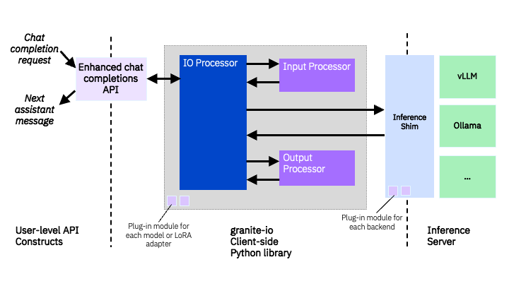
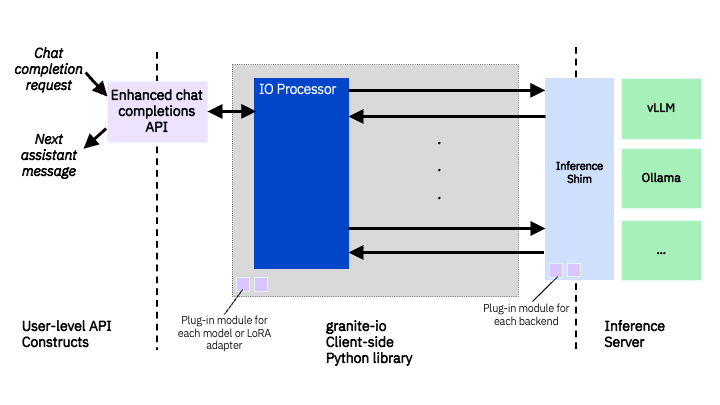
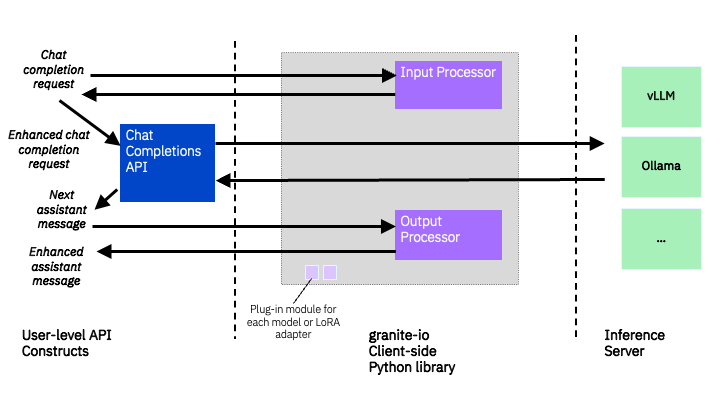

# Granite IO Processing Design

## Abstract

A framework which enables the transformation of inference requests to an [IBM Granite model](https://www.ibm.com/granite) and also the transformation of the output returned from the model.

## Motivation

An IBM Granite model provides a number of additional capabilities baked into the model. Some of the capabilities supported are as follows:

- [RAG](https://www.ibm.com/granite/docs/models/granite/#retrieval-augmented-generation-(rag)-with-annotations)
- [Reasoning](https://www.ibm.com/granite/docs/models/granite/#reasoning)
- [Function calling](https://www.ibm.com/granite/docs/models/granite/#function-calling)

As the chat template or prompt can be complex to create in order to use these capabilities in the model, it would be really useful to be able to just enable a particular capability in addition to your prompt.

## Rationale

If a user prompts the model and upon receiving the answer is a little unsure about its correctness, it would be helpful if the user can ask the model how it arrived at its answer -- in other words its reasoning. Retrieval augmented generation (RAG) is an architecture for optimizing the performance of an artificial intelligence (AI) model by connecting it with external knowledge bases. If a user uses document(s) to deliver more relevant responses then it would be helpful to cite those document(s) or sources in the output. In other words, it would be beneficial to be able to turn on capabilities when prompting the model.

## Specification

### Architecture

The key architectural components are:

- Backend: A shim that provides a thin abstraction to different runtime backends for serving models for inference.
- Input Processor: A processor that transforms a chat request prior to sending it to the model.
- Output Processor: A processor that transforms output of a chat request from the model.
- Input/Output (IO) Processor: A processor that contains both an input and output processor, and (optionally) a backend.

The overall architecture is fairly straightforward. At the top level, there are _InputProcessors_ and _OutputProcessors_. The Input Processor transforms a chat request into the format the model requires to perform its baked-in additional capabilities. The Output Processor transforms the output from the model into a more usable format. The _InputOutputProcessor_ is a component that combines both an input processor and an output processor within a single entity. It also contains a _Backend_ so that it can perform the chat request with the model and then pipe the output to the output processor. The first diagram below shows an IO Processor that integrates both processors and backend within a single component.



The IO processor architecture above represents a single turn chat request. In other words, you process the chat request input, inference the model, and finally process the output from the model. The IO processor architecture is however flexible and able to handle more multi-turn scenarios where there are multiple inference calls which feed output from one call as input to the next. The diagram that follows demonstrates how the IO processor can be implemented without specific input and output processors 



The next diagram shows how Input and Output Processors can be used independently with the user performing chat request directly with the model. In this instance the user is free to configure what input and output processor to use -- perhaps using just one instead of both.



### Input Processor

Input processors need to implement the `InputProcessor` interface which is defined [here](https://github.com/ibm-granite/granite-io/blob/main/src/granite_io/io/base.py) (see below for interface snippet).

```Python
class InputProcessor(FactoryConstructible):
    """
    Interface for generic input processors. An input processor exposes an
    API to transform model completion request into a string representation.
    """

    def __init__(self, config: aconfig.Config | None = None):  # pylint: disable=unused-argument
        """By default an input processor doesn't require config"""

    @abc.abstractmethod
    def transform(
        self, inputs: ChatCompletionInputs, add_generation_prompt: bool = True
    ) -> str:
        """
        Convert the structured representation of the inputs to a completion request into
        the string representation of the tokens that should be sent to the model to
        implement said request.

        :param inputs: Structured representation of the inputs
        :param add_generation_prompt: If ``True``, the returned prompt string will
            contain a prefix of the next assistant response for use as a prompt to a
            generation request. Otherwise, the prompt will only contain the messages and
            documents in ``input``.

        :returns: String that can be passed to the model's tokenizer to create a prompt
            for generation.
        """
```

The framework supports the following input processors out of the box:

| Name | Aliases | Description | Definition |
|---|------|-----|-----|
| Granite 3.2 || Standard Granite 3.2 input processor | [here](https://github.com/ibm-granite/granite-io/blob/main/src/granite_io/io/granite_3_2/input_processors/granite_3_2_input_processor.py) |

### Output Processor

Output processors need to implement the `OutputProcessor` interface which is defined [here](https://github.com/ibm-granite/granite-io/blob/main/src/granite_io/io/base.py) (see below for interface snippet).

```Python
class OutputProcessor(FactoryConstructible):
    """
    Interface for generic output processors. An output processor exposes an
    API to transform model output into a structured representation of the
    information.
    """

    def __init__(self, config: aconfig.Config | None = None):  # pylint: disable=unused-argument
        """By default an output processor doesn't require config"""

    @abc.abstractmethod
    def transform(
        self, output: GenerateResults, inputs: ChatCompletionInputs | None = None
    ) -> ChatCompletionResults:
        """
        Convert the model output generated into a structured representation of the
        information.

        :param output: Output of a generation request, potentially incomplete
           if it was a streaming request
        :param inputs: Optional reference to the inputs that caused the model to produce
           ``output``, for validating the correctness of the output. If no inputs are
           provided, this method may skip some validations but will still produce the
           same result.

        :returns: The parsed output so far
        """
```

The framework supports the following output processors out of the box:

| Name | Aliases | Description | Definition |
|---|------|-----|-----|
| Granite 3.2 || Standard Granite 3.2 output processor | [here](https://github.com/ibm-granite/granite-io/blob/main/src/granite_io/io/granite_3_2/output_processors/granite_3_2_output_processor.py) |

### IO Processor

IO processors need to implement the `InputOutputProcessor` interface which is defined [here](https://github.com/ibm-granite/granite-io/blob/main/src/granite_io/io/base.py) (see below for interface snippet).

As you can see from the interface, there is a lot of flexibility to implement your IO processor however you want. There is no restriction on having to use an input and/or output processor. This flexibility is essential when having to implement multi-turn scenarios as described previously.

```Python
class InputOutputProcessor(FactoryConstructible):
    """
    Interface for generic input-output processors. An input-output processor exposes an
    API similar to a chat completions API. Each "completion" call may result in multiple
    LLM calls or even zero LLM calls, depending on the implementation of the
    input-output processor.
    """

    def __init__(self, config: aconfig.Config | None = None):  # pylint: disable=unused-argument
        """By default an IO processor doesn't require config"""

    @abc.abstractmethod
    async def acreate_chat_completion(
        self, inputs: ChatCompletionInputs
    ) -> ChatCompletionResult:
        """
        :param inputs: Structured representation of the inputs to a chat completion
            request, possibly including additional fields that only this input-output
            processor can consume

        :returns: The next message that the model produces when fed the specified
            inputs, plus additional information about the low-level request.
        """

    def create_chat_completion(
        self, inputs: ChatCompletionInputs
    ) -> ChatCompletionResult:
        """
        Non-async version of :func:`acreate_chat_completion()`

        :param inputs: Structured representation of the inputs to a chat completion
            request, possibly including additional fields that only this input-output
            processor can consume

        :returns: The next message that the model produces when fed the specified
            inputs, plus additional information about the low-level request.
        """
        # Fall back on async version of this method by default.  Subclasses may override
        # this method if they have a more efficient way of doing non-async operation.
        coroutine_to_run = self.acreate_chat_completion(inputs)
        try:  # Exceptions as control flow. Sorry, asyncio forces this design on us.
            asyncio.get_running_loop()

            # If we get here, this code is running inside an async function.
            return _workaround_for_horrible_design_flaw_in_asyncio(coroutine_to_run)
        except RuntimeError:
            # If we get here, this code is not running inside an async function.
            # First we exit the the exception handler; otherwise any exceptions that are
            # thrown from the coroutine will be chained off the current RuntimeError.
            pass
        return asyncio.run(coroutine_to_run)
```

The framework supports the following IO processors out of the box:

| Name | Aliases | Description | Definition |
|---|------|-----|-----|
| Granite 3.2 | ibm-granite/granite-3.2-2b-instruct, ibm-granite/granite-3.2-8b-instruct, granite3.2, granite3.2:8b, granite3.2:2b, ibm-granite/granite-8b-instruct-preview-4k | Standard Granite 3.2 IO processor | [here](https://github.com/ibm-granite/granite-io/blob/main/src/granite_io/io/granite_3_2/granite_3_2.py) |

### Backend

Backends need to implement the `Backend` interface which is defined [here](https://github.com/ibm-granite/granite-io/blob/main/src/granite_io/backend/base.py) (see below for interface snippet).

```Python
class Backend(FactoryConstructible):
    """
    Base class for classes that provide an interface to a string-based completions API
    for a model.

    This base class exists for two reasons: It smooths out the differences between
    APIs, and it provides a level of indirection so that backend inference libraries can
    be optional dependencies of this Python package.
    """

    _model_str: str

    def __init__(self, config: aconfig.Config):
        self._model_str = config.model_name

    async def __call__(self, inputs: GenerateInputs) -> GenerateResults:
        return await self.pipeline(inputs)

    async def pipeline(self, inputs: GenerateInputs) -> GenerateResults:
        """
        Process input, call completion (generate), process and return output
        """
        inputs = self.process_input(inputs)
        output = await self.generate(inputs)
        return self.process_output(output)

    def process_input(self, inputs: GenerateInputs) -> GenerateInputs:
        """
        Process kwargs to prepare them for completion.create() (or generate())

        Args:
            inputs (GenerateInputs): the inputs which are being processed (modified)
             to be used in target backend call.
        """

        # Add required model, if missing
        if not inputs.model:
            inputs.model = self._model_str

        # n (a.k.a. num_return_sequences) validation
        n = inputs.n
        if n is not None:  # noqa SIM102
            if n < 1:
                raise ValueError(f"Invalid value for n ({n})")
            if n > 1:
                # best_of must be >= n
                best_of = inputs.best_of
                if best_of is None or best_of < n:
                    inputs.best_of = n

        return inputs

    @abc.abstractmethod
    async def generate(self, inputs: GenerateInputs) -> GenerateResults:
        """
        Callback to invoke the model to generate a response.
        """
        raise NotImplementedError()

    def process_output(self, outputs):
        """
        Process output from completion.create() (or generate())
        """
        results = []
        for choice in outputs.choices:
            results.append(
                GenerateResult(
                    completion_string=choice.text,
                    completion_tokens=[],  # Not part of the OpenAI spec
                    stop_reason=choice.finish_reason,
                )
            )

        return GenerateResults(results=results)

    @staticmethod
    def kwarg_alias(kw_dict, preferred_key, alias_key):
        """Migrate kwarg k,v from alias key to preferred key"""
        if alias_key in kw_dict:
            alias_value = kw_dict.get(alias_key)
            # Alias is removed
            del kw_dict[alias_key]
            # Preferred key/value gets priority if both are specified
            # TODO: optionally error on redundant kwargs(?)
            if preferred_key not in kw_dict:
                # Alias value is set to preferred key (iff not already set)
                kw_dict[preferred_key] = alias_value
        return kw_dict  # return reference for convenience
```

The framework supports the following backends out of the box:

| Name | Description | Definition |
|---|-----|-----|
| LiteLLM | LiteLLM shim | [here](https://github.com/ibm-granite/granite-io/blob/main/src/granite_io/backend/litellm.py) |
| OpenAI | OpenAI shim | [here](https://github.com/ibm-granite/granite-io/blob/main/src/granite_io/backend/openai.py) |
| Transformers | Transformers shim | [here](https://github.com/ibm-granite/granite-io/blob/main/src/granite_io/backend/transformers.py) |

### Implementation

The framework is implemented as a Python library. There are examples of model chat requests using the framework in [examples](../examples/).

## Extending Processor Capability

Creating new input, output and IO processors is supported. The sections in [Specification](#specification) explain the interfaces that are required for each processor to implement. There are examples of creating new processors using the framework in [examples](../examples/).
