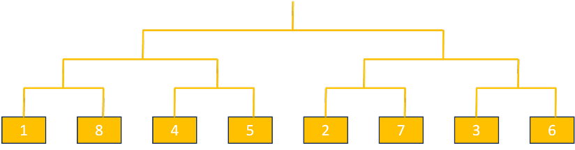
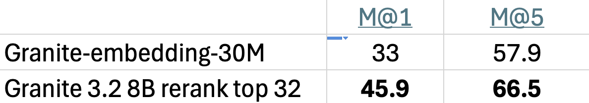
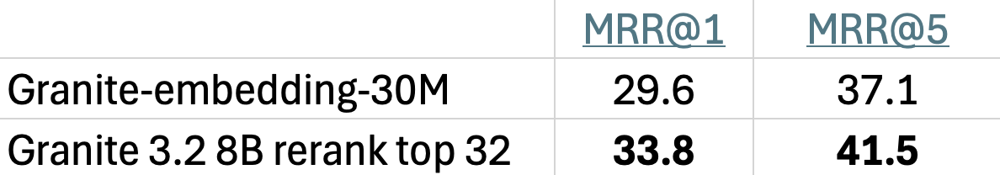
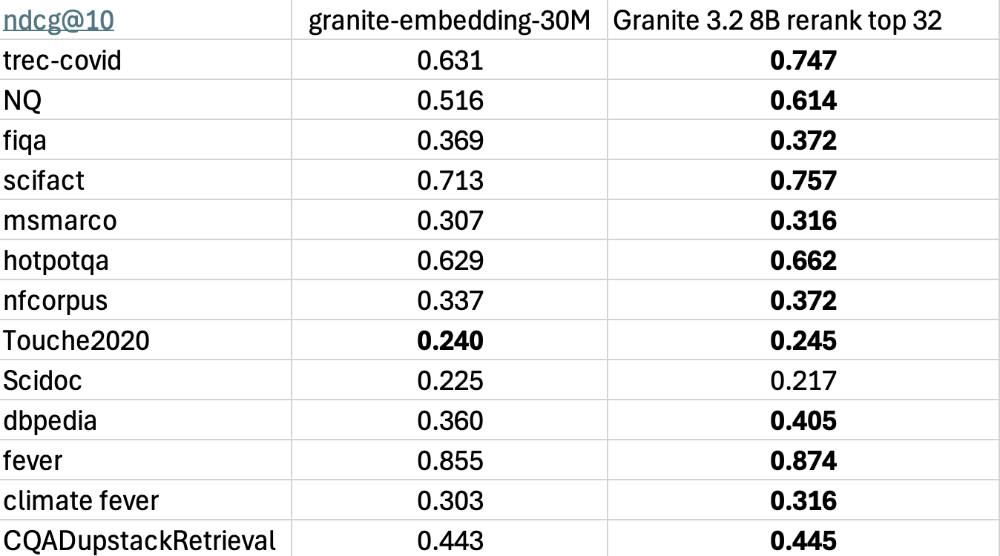

# Overview

This module supports using LLM as a reranker to rerank the retrieved passages. It takes the output of retrieval step as input and returns a reorder of passges which can be then used for generation. Evaluation on multiple domains and tasks shows that it can significanly improve the retrieval result with low latency and minimum code change. 

# Algorithm

The reranking is done in a tournament style by asking the LLM to compare paired passages and return the label of preferred one. The users can provide their own prompt otherwise the default prompt is used.

## Default prompt
`You are a smart and helpful AI assistant with in-depth knowledge
about how people search for information using search engines. In this task, you are 
given two passages, and a query, your job is to judge which passage is relatively more
suitable to answer that query. The first passage will start with "passage A" and the 
second passage with start with "passage B". Output the preferred passage index, i.e. A 
or B and followed by an explanation, if none of the passage answer the query directly, 
pick the one that has more relevant information.`

## Tournament
When number of reranking passage is less than 10, LLM compares the all possible paires and rank by each passage's win count. All or mulitple pairs are grouped into single batch for efficiency. 
When the number of reranking passage is larger than 10, LLM forms pairs like the example below and only pick the winning passages for the next round. 
For similicity, it only compares even number of passages and drops the last passage if there are odd number of passages



# Code snippet to run
```
    # Spin up an in-memory vector database
    retriever = InMemoryRetriever(embeddings_location, embedding_model_name)

    # Use a RetrievalRequestProcessor to augment the chat completion request with
    # documents.
    rag_processor = RetrievalRequestProcessor(retriever, top_k=32)
    rag_chat_input = rag_processor.process(chat_input)[0]

    # rerank with llm
    rerank_processor = RerankRequestProcessor(
        io_proc, rerank_top_k=16, return_top_k=16, verbose=True
    )
    rerank_chat_input = rerank_processor.process(rag_chat_input)
```

# Evaluation results

## IBM internal benchmark 1


## IBM internal benchmark 2


## BEIR benchmark
We also provide the reranking result for popular BEIR benchmark as reference. By closely examing the reranking results, we found that a large amount of the LLM reranked top passages cross different tasks are at least as goog as the gold passage. We suspect this contributes to the performance drop in some tasks. 



# Speed

Unlike most generation tasks, reranking only needs to ouput 1 single preferance token, A or B. Therefore, the processing time is significantly less than regular generation and it only adds a small overhead in the end to end RAG pipeline. For example, it takes about 1.3 seconds to finish the reranking tournament using the example given by `rerank_with_llm.py`. Speed in real case would depend on running environment and query/document length. 

# Future work
Possible future works include:
1. Support reranking multiple passages all together
2. Further reducing the processing time by reusing the KV caching of prompts
